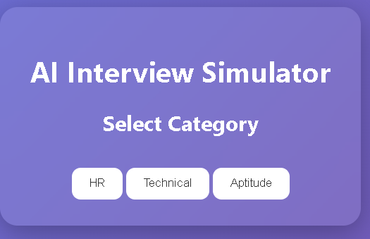
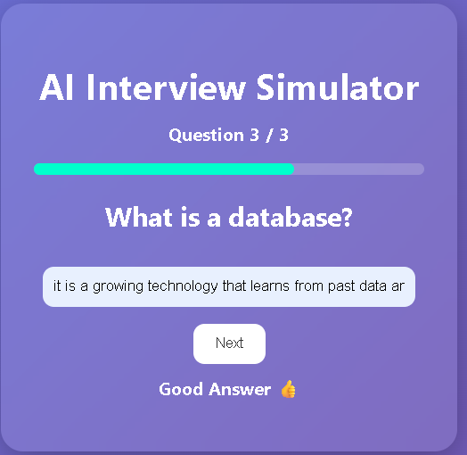
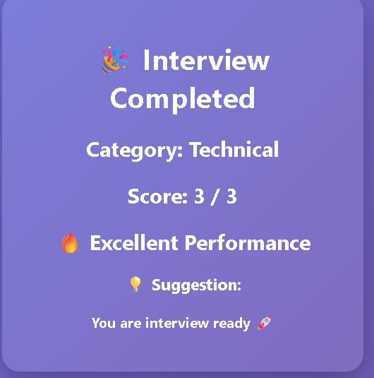

# 🤖 AI Interview Simulator

An AI-based Interview Preparation System built using Flask that helps users practice interview questions with real-time feedback, progress tracking, and performance analysis.

---

## 🚀 Features

- 🎯 Category-based Interview (HR / Technical / Aptitude)
- 💬 Real-time Answer Feedback
- 📊 Score Calculation
- 📈 Progress Bar Tracking
- 🧠 Performance Analysis (Excellent / Good / Average / Improve)
- 🎨 Modern Glassmorphism UI

---

## 🛠️ Tech Stack

- Python (Flask)
- HTML
- CSS
- JavaScript (basic)

---

## 📂 Project Structure

AI_Interview_System/ │ ├── app.py ├── questions.py ├── analyzer.py │ ├── templates/ │   ├── index.html │   ├── result.html │ ├── static/ │   ├── style.css

---

## ▶️ How to Run

1. Install Flask:
 pip install flask
2. Run The Project:
 python app.py
3. Open in browser:

After running the Flask server, open your browser and go to:
http://127.0.0.1:5000/

(Note: This works only on your local machine)
---

## 📸 Screenshots

(Add screenshots here after running project)
## 📸 Screenshots

### 🏠 Home Page

### 💻 Interview Screen

### 🎉 Result Page

---

## Live Demo
https://ai-interview-system-7jio.onrender.com

---

## 🎯 Future Improvements

- 🌙 Dark Mode Toggle
- 🧠 Real AI Integration (OpenAI API)
- 👤 User Login System
- 📊 Advanced Dashboard

---

## 👩‍💻 Author

- Muskan Mujawar

---

## ⭐ If you like this project, give it a star!
